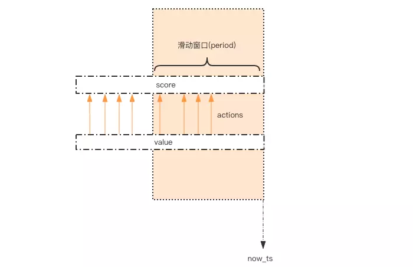

## 限流策略

1. 基本限流

* 开发中我们总会用到控制用户行为的功能,比如说在一定时间范围内对用户的回复条数进行限制,
超过了次数就是非法行为

* 通产我们的做法是使用计数的方式(使用redis的string类型以用户id为key用户触发一次请求value就加1).
但这样做会产生很大的问题

* 比如：限定用户5分钟内不能超过10次触发,用户在第一分钟触发1次计数加1,在第四分钟触发9次计数累计到10,
之后再五分钟结束前不会计数增加,而在第六分钟用户上一阶段的限制已经过期,用户在第六分钟开始到第六分钟结束
可以触发10次,第四分钟开始到第六分钟结束两分钟内用户合法请求19次.

* 解决方案:

```
abstract function is_action_allow(user_id,action,period,max_count);
```

 


* 这个限流中存在时间滑动窗口,我们可以用zset的score值来圈出这个时间窗口,我们只需要保留这个时间窗口内的计数
窗口外的统统砍掉,而zset的value值只需要保证唯一性即可,用时间戳来填充

```
public function is_action_allow($user_id,$action,$period,$max_count){
	$key = $user_id.':'.$action;
	$now = time();
	$redis = new Redis();
	$redis->zadd($key,$now,$now); 	//第一个参数为key 第二个参数为score 第三个参数为value
	$redis->zremrangeByScore($key,0,$now - $period*1000); //移除过期时间范围外的所有数据
	$count = $redis->zcard($key); 	//获取窗口内行为数量
	$redis->expire(key,$period + 1);//为key设置过期时间 时间范围为窗口大写在加1s
	return $count <= $max_count;
}

```

* 这种限流策略的基本思想就是当每一个行为到来都维护一个时间窗口,将窗口外的记录清理


